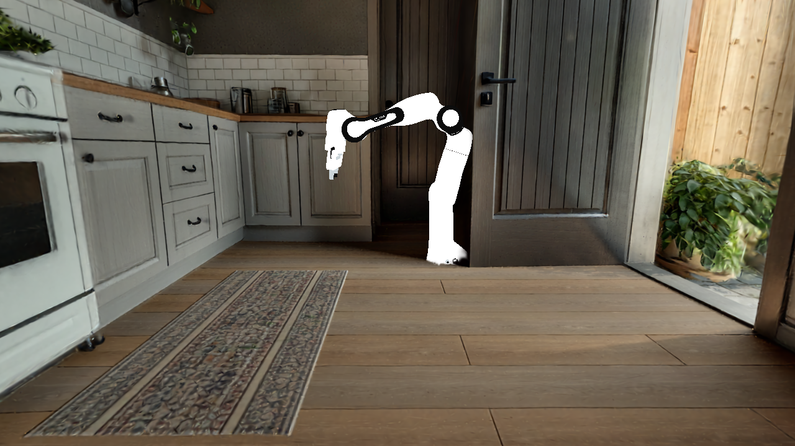

# part5-exp — feature5：真实 Franka 合成进 3DGS 厨房

设计文档见 [feature5](../features/feature5_franka_in_3dgs_kitchen.md)。本记录留详细数据/调试；提炼结论回填 feature5。依赖 feature4 的 pybind 渲染器（`Renderer.add_mesh`/`set_mesh_transform`，[part4-exp](part4-exp.md) M1.0/M1.1 ✅）。

## 总览

| Exp | 目标 | 状态 | 结论 |
|---|---|---|---|
| F1 | 真 Franka(home) 多连杆 visual + workshop overview cam(映射 splat) → 静态合成一帧 | **✅ 通** | 58 连杆 .obj 合成进 3DGS 厨房,轮廓/尺度/朝向/深度全对;坐标链一次命中。遗留:轻微悬空 + 统一灰(→F1.1) |
| F1.1 | 按 `panda.xml` material 给各 visual 件上色 | **✅ 通** | 扩 pybind `set_mesh_color`;白/黑/off_white/light_blue/green 逐件套上 → Franka 现真机白底+黑关节+腕部彩件,不再一片灰 |
| F2 | 关节轨迹逐帧 FK → Franka 在厨房里动 | 待 | — |
| F3 | `gs-gsplat-plugin` sensor + 红方块抓取 episode 出视频 | 待 | — |

---

## F1 — 真 Franka 静态合成一帧（home pose + overview cam）

### 假设
Franka 的 visual 是一堆 link-local 系的 `.obj`（vk_gs 直接可读）。只要拿到各 link 在 home 位姿下的**世界 FK 位姿**（Genesis 零 GPU 出），经 feature3 的 Genesis→splat 映射喂给 feature4 的 `add_mesh`+`set_mesh_transform`，再把 workshop 的 overview 相机同样映射到 splat 系，就能渲出「Franka(home 弯臂)站在 3DGS 厨房地板上、尺度/朝向合理」的一帧——即验证「真机器人资产 + workshop 摆位/相机」这条集成链路。

### 坐标推导（workshop Genesis → splat）

**基础映射（feature3）**：`p_splat = R·p_gen + t`，`R:(x,y,z)→(x,z,-y)`（Z-up→Y-up），`t=(0,-1.1,0.92)`（splat 地板中心），`s=1`。向量（up/朝向）只施 R。

- **R 作为 mat4（列主序，喂 `set_mesh_transform`）**：把 model/link 的 Z-up 转成 splat Y-up = `R_x(-90°)`：`new=(x, z, -y)`。每个 link 的 world mesh 变换 = `Translate(t) · R · LinkWorldT_gen`（`LinkWorldT_gen` = Genesis 里该 link 的世界位姿 pos+quat）。
- **Franka base**：Genesis `(0,0,-0.68)`（floor_origin, on floor）。注：workshop `floor_z=-0.68` 是 GLB 地板在 Genesis 的高度；splat 地板在 `t.y=-1.1`。F1 先把 **base 直接摆到 splat 地板中心** `t`（即把 Genesis 的 base 原点对齐到 splat 地板中心），link 相对 base 的 FK 偏移经 R 施加——回避 workshop GLB 与 splat 两套原点的绝对对齐（经验校准项）。
- **overview cam**（Genesis 世界，`s=1.5`，相对 base 偏移）：
  - `pos_off_gen=(0, 0.8·1.5, 0.65·1.5)=(0,1.2,0.975)`；`lookat_off_gen=(0,-0.6·1.5,0.45·1.5)=(0,-0.9,0.675)`。
  - 经 R：`pos_off_splat=(0,0.975,-1.2)`；`lookat_off_splat=(0,0.675,0.9)`；`up=R·(0,0,1)=(0,1,0)`。
  - 加 base(splat)=`t=(0,-1.1,0.92)`：**`eye≈(0,-0.125,-0.28)`、`lookat≈(0,-0.425,1.82)`、`up=(0,1,0)`、fov65**。
  - 🔑 交叉验证：该 eye/lookat 恰落在 feature3 E2c 验证过的室内位姿邻域（E2c pose0 `eye=(0,-0.3,0.92)` 看 +Z），说明推导自洽。

### 方案（KISS，两容器分工，复用 feature3/feature4）
1. **Genesis 侧**（`zhengjli_nyx`，`gs.cpu`+EGL 零 GPU）：`load_franka(pos=0)`+`set_franka_home`+`build`，遍历 `franka.links` 取每个 link 世界 `(pos, quat)`；按名映射到其 visual `.obj` 列表（`linkN_*`→linkN、`hand_*`→hand、`finger_*`→finger）。dump `franka_home.json`。
2. **vk_gs 侧**（`vkgs_build`，GPU1）：`Renderer(kitchen.ply)`；对每个 link 的每个 `.obj`：`idx=add_mesh(obj)`；`set_mesh_transform(idx, Translate(t)·R·LinkT_gen)`（同一 link 的 obj 共享该 link 变换，假设 obj 顶点 link-local）；`set_camera(overview_splat)`；`step`；`readback`+`save_png`。

### 预期
一帧 PNG：3DGS 厨房背景 + 前景 Franka（home 弯臂、站地板、~1m 尺度、up 朝上），各连杆拼合成完整机械臂不散架，与橱柜/地板相对位置合理。

### 风险/待测未知
- **per-geom local offset**：若某 link 的 obj 非 link-local（有 geom 局部 pos/quat）→ 该部件错位；F1 先看整体，必要时从 Genesis vgeom 取精确 per-geom 世界变换（更稳但更重）。
- **quat 约定**：Genesis quat = wxyz；转 mat4 时注意顺序；R∘quat 复合的手性别搞反（出镜像/侧躺则 R 或 quat 错）。
- **绝对落点**：base 对齐到 splat 地板中心是近似；若 Franka 陷地/悬空，微调 base 的 y（沿 splat up）。

### 结果（F1 — ✅ 通，2026-07-10 @ vkgs_build/GPU1）

Genesis 侧（`zhengjli_nyx`，`gs.cpu`+EGL，零 GPU）`load MJCF panda + set home qpos + build` → dump 11 个 link 世界位姿（`_f1_fkdump.py`）。vk_gs 侧（GPU1）按 `panda.xml`（**所有 visual geom 无 per-geom pos/quat → mesh 全在 link-local 系，per-link 假设成立**）前缀映射 obj→link，`add_mesh` **58 个 visual `.obj`** + 各 `set_mesh_transform(T(t)·R4·T(P_gen)·Rot(Q_gen))`，overview cam（splat）渲一帧。

- **Franka（home 弯臂姿）成功合成进 3DGS 厨房**：经典 Franka 轮廓，58 连杆件拼合不散架；深度正确（机械臂遮挡门/橱柜、右侧被门框遮）；尺度合理（~1m 臂长匹配厨房）。

| overview cam（workshop 映射 splat） | 整机正面取景 |
|---|---|
|  |  |
- **坐标链验证**：workshop Genesis FK 位姿 + overview cam，经 feature3 `R:(x,y,z)→(x,z,-y)`+`t=(0,-1.1,0.92)` 映射 → splat，一次命中，无侧躺/镜像 → R/quat 复合手性正确。overview cam 落在 E2c 室内邻域（自洽）。

### 踩坑与结论（F1）
1. **Franka visual = 纯 .obj**（`panda.xml` `<mesh file="linkN_*.obj">`），vk_gs 直读，**无需 .stl 转换**；collision（`.stl`/`*_collision*.obj`）跳过。
2. **per-link 假设成立**：visual `<geom>` 只有 `mesh=`+`material=`、无 `pos/quat` → obj 顶点 link-local，同 link 的多 obj 共享该 link 世界变换。
3. **obj→link 前缀映射**：`linkN_*`→linkN、`hand_*`→hand、`finger_0/1.obj` → 两 finger 各一份（共 4 实例）。合计 58 visual 实例。
4. **列主序 mat4**：numpy 4x4 经 `flatten('F')` 喂 `set_mesh_transform`（glm 列主序）——朝向正确即验证转换对。

### 待精修（→ F1.1，非阻断）
- **轻微悬空**：整机比地板高 ~0.3m（正面取景可见臂底未贴地）；base 的 splat-y 微调（`t.y` 或按 link0 底面偏移）即可贴地——feature5 已预判的经验校准项。
- **统一灰**：obj 无色、未套 MJCF material（white/black/off_white/light_blue/green）→ Franka 一片灰。上色需 `add_mesh` 支持 per-geom 材质/颜色（feature4 API 小扩展），或按 `panda.xml` 的 geom→material 逐件设色。视觉真实性用，非 F1 目标。

### next-step
- **F1.1**（可选精修）：贴地 base-y + 按 `panda.xml` material 上色。→ 上色部分见下节（✅）；贴地 base-y 仍待。
- **F2**：关节轨迹逐帧 FK（Genesis 出每帧各 link 位姿）→ 逐帧 `set_mesh_transform` → Franka 在厨房里动（复用本管线，位姿改为逐帧）。

---

## F1.1 — 按 MJCF material 逐件上色（✅ 通，2026-07-10 @ vkgs_build/GPU1）

### 假设
F1 里 Franka 一片灰，是因为 obj 无 `.mtl`、`add_mesh` 加载后拿默认灰 baseColor，而 MJCF 的颜色定义在 `panda.xml` 的 `<material>`（不在 obj 里）。只要 (a) pybind 暴露一个「设某 mesh 实例 baseColor」的口，(b) 按 `panda.xml` 的 `<geom mesh=".." material="..">` 把每个 visual 件映射到对应颜色，逐件设色，即能还原 workshop 里的真机配色（白底 + 黑关节 + 腕部 light_blue/green 小件）。

### 方案（KISS，复用 F1 管线，只加一个 API）
1. **pybind 扩一个方法** `Renderer.set_mesh_color(idx, [r,g,b])`（`src/vkgs_pybind.cpp`）：取该实例 `mesh->materials[*].baseColor = rgb` 后 `updateMeshMaterials(mesh)`（与 `light_manager_vk` 改色同法;每次 `add_mesh` 生成独立 `MeshVk`,故按实例设色安全)。容器内 `cmake --build` 重编 `vkgs*.so`。
2. **material 表**（`panda.xml` `<asset>`，sRGB rgba）：`white=1,1,1`/`off_white=.902,.922,.929`/`black=.25,.25,.25`/`green=0,1,0`/`light_blue=.039,.541,.780`。
3. **mesh→material 表**：逐条抄 `panda.xml` 各 `<geom mesh="linkN_k" material="..">`（如 `link6_7/8=light_blue`、`link6_12=green`，其余多为 white/black/off_white）。`_f1_render.py` 里 `add_mesh` 后按 obj basename 查表 `set_mesh_color`。
4. **sRGB→linear**：vk_gs 在**线性空间**着色（obj_loader 对 obj 色做 `pow(2.2)`），故设色前把 sRGB 值 `**2.2` 转线性再喂 `set_mesh_color`，避免偏亮。

### 结果
Franka 现出真机配色:**白色本体 + 黑色关节/接缝 + link0 底座黑白件**,腕部(link6)可见 light_blue/green 小件;不再一片灰。深度/尺度/朝向同 F1 不变。

| overview cam（上色后） | 整机正面（上色后） |
|---|---|
|  |  |

### 结论 / 踩坑
1. **颜色不在 obj、在 MJCF material** → 上色必须外挂 `panda.xml` 的 geom→material 映射,逐件设色;不能指望 obj 自带。
2. **API 极小**:`set_mesh_color(idx,rgb)` 直改实例 `MeshVk` 的 `materials[*].baseColor` + `updateMeshMaterials` 触发 GPU 材质上传,一处扩展即够。
3. **线性空间**:sRGB 值须 `**2.2` 转线性再设,否则整体偏亮(与 obj_loader 对 obj 色的处理一致)。
4. commit `9c58ef9 feature4 F1.1: set_mesh_color`（本地 `vk_gaussian_splatting@feature4_pybind`）。
5. **管线已沉淀**：一次性 `_f1_fkdump.py`/`_f1_render.py` 整理为 `scripts/` 下三件耐久脚本（`franka_kitchen_common.py` 复用核 + `franka_fk_dump.py` + `franka_render_kitchen.py`，全 argparse、poses JSON 解耦、多帧就绪），复现同图（58 instances、无 skip）。运行见 [feature5 复现/运行](../features/feature5_franka_in_3dgs_kitchen.md)。承接 F2 motion 只需 `--qpos-json` 出多帧 + render 多帧循环。

### 待精修
- **贴地 base-y**（F1 遗留,未做）:整机比地板高 ~0.3m,微调 `t.y`/按 link0 底面偏移即可。
- **金属感/高光**:当前只设 baseColor,未套 MJCF 的 `specular=0.5 shininess=0.25`;视觉够用,精修可再扩 metallic/roughness。
