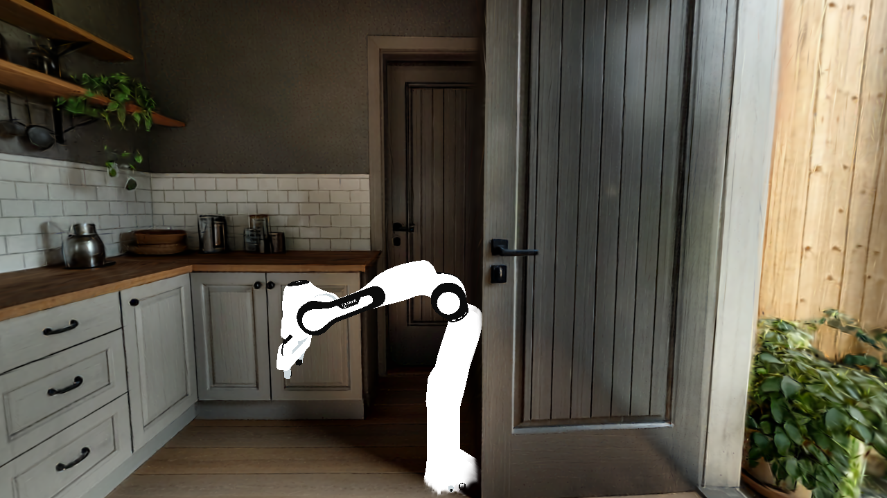

# 3dgs_scene — AMD 上的 3DGS 场景 + 机器人渲染

> **Status: ✅ vk_gs 路径基本走通** — 目标：Genesis 下 AMD 上做「3DGS 场景 + 机器人操作」的统一渲染。Genesis **默认的 Nyx 路径在 AMD 被 libcuda 卡死**（见下「为什么不走默认 Nyx」），已 pivot 到 **vk_gaussian_splatting（vk_gs）** 自建渲染路径。当前进度：vk_gs 在 RADV/RDNA4 编译 + 三管线统一渲染跑通（feature2），pybind 渲染器可动态加 mesh/逐帧变换/回读（feature4），真实 Franka(home)多连杆 visual + MJCF 上色已合成进 3DGS 厨房（feature5 F1/F1.1）。下一步：逐帧 FK motion（F2）→ 抓取 episode 视频（F3）。

原目标对应上游 [issue #1358](https://github.com/Genesis-Embodied-AI/genesis-world/issues/1358)（Genesis 1.0 由 Nyx plugin 解决 3DGS 渲染，但仅 NVIDIA）。

## 现状：vk_gs 路径（Nyx 的 AMD 替代）

拆成两个正交层，均已在 AMD R9700/gfx1201 上落地：

| 层 | feature | 状态 | 交付 |
|---|---|---|---|
| 渲染层 | [feature2](docs/features/feature2_vksplatting_radv.md) | ✅ | vk_gs 在 RADV/RDNA4 编译（fork `rdna4_support`，`USE_DLSS=OFF`）；raster/rt/hybrid 三管线 + mesh+splat 统一渲染 |
| 集成层·渲染器能力 | [feature4](docs/features/feature4_perframe_robot_mesh.md) | ✅ M1.0/M1.1 | pybind `Renderer`：`add_mesh`/`set_mesh_transform`/`set_mesh_color`/逐帧 TLAS/RGBA8 回读 numpy |
| 集成层·应用（离线合成） | [feature5](docs/features/feature5_franka_in_3dgs_kitchen.md) | 🔄 F1/F1.1 ✅、F2 🔄 | 真 Franka(home, 58 连杆 visual `.obj`) + workshop 相机映射 splat + MJCF material 上色 → 合成进 3DGS 厨房；F2 逐帧 motion |
| 集成层·在线 sensor | [feature6](docs/features/feature6_gsplat_sensor_plugin.md) | 📋 计划 | `gs-gsplat-plugin`：把渲染器接成 Genesis camera sensor，`scene.step()` 内联出帧 + 抓取 episode（原 feature5 F3） |

**Franka 合成管线**已沉淀成 `scripts/franka_kitchen/`（复现/参数见 [feature5 复现·运行](docs/features/feature5_franka_in_3dgs_kitchen.md)）：`franka_kitchen_common.py`（坐标/配色/映射复用核）+ `franka_fk_dump.py`（Genesis 侧 FK 位姿 dump）+ `franka_render_kitchen.py`（vk_gs 侧上色渲染，单帧多相机 / 多帧 motion）+ `gs_gsplat_plugin.py`（feature6 在线 sensor）+ `s1_sensor_demo.py`/`gate_a_concurrent.py`（runner）。运行在 `vkgs_build` 容器（编译见 [`scripts/build_vkgs_amd.sh`](scripts/build_vkgs_amd.sh)），pose 侧零 GPU。



---

## 已知局限：注入 mesh 是「平光照」（无 shading，看着发灰/剪纸感）

**现象**：所有注入 vk_gs 的机器人 mesh（Franka、Go2 …）都偏灰、缺立体感，像贴片而非有明暗的物体。**这不是配色 bug**（各子材质 baseColor 正确保留：如 Go2 顶壳 `[171,177,197]` 银灰 + 白饰条 + 近黑机身，与源 `.dae` 一致），而是**渲染器默认不给 mesh 打光**。

**根因**（vk_gs 渲染器 `vk_gaussian_splatting/shaders/`）：默认 `LIGHTING_DISABLED`（`parameters.h`），mesh 颜色 = `baseColor + emissive`，**无 N·L / 无光源 / 无 env / 无 AO**。三角 closest-hit（`shaders/threedgrt_raytrace.rchit.slang`）只打包法线/UV 不算色；着色在 raygen（`threedgrt_raytrace.rgen.slang:1370-1377` 的 `LIGHTING_DISABLED` 分支直接输出 flat baseColor）。**splat 本身是 pre-lit（颜色已烘焙）不受影响，只有注入 mesh 缺光照。**

> 注意：完整 PBR + 方向/点光 + 物理天空 + HDRI/IBL + NEE + 阴影基建**其实都在**（`shading.h.slang`、`LightManagerVk`、`SkySunAndIbl`、`evaluateLightingAndShadingMeshes()`），只是默认关闭；且 headless pybind（`vkgs_pybind.cpp`）只暴露 `add_mesh/set_mesh_transform/set_mesh_color`，**没暴露任何光照/env 开关**。法线在 mesh hit 里可用（`pixel.meshHitWorldNrm`）。

**如何 fix**（由简到全，深水区 = 渲染层，非应用层 feature8/9 范围）：

| 档 | 做法 | 改动量 |
|---|---|---|
| **A. 开现有光照**（推荐） | 置 `prmRender.lightingEnabled = LIGHTING_ENABLED`（触发 shader 重编）+ 至少加一个光源（`LightManagerVk`）或开 sky/HDR env（`frameInfo.envEnabled=1, envMode!=NONE`）；**并在 `vkgs_pybind.cpp` 暴露这些开关**给 headless 调用 | 中（无 shader 改，主要补 pybind API） |
| **B. RT 补 headlight** | raygen `evaluateLightingAndShadingMeshes()`（`~:1568`）在 `lightCount==0 && !env` 时套 `createHeadlight(cameraPos)` + `wavefrontComputeShadingDirectOnly()`（照抄光栅 `threedmesh_raster.frag.slang:106-111`）→ 无需摆光源也有相机头灯明暗 | 小（照抄光栅现成逻辑） |
| **C. shader hack Lambertian** | `threedgrt_raytrace.rgen.slang:1365-1378` 的 `LIGHTING_DISABLED` 分支，用 `unlitNrm` 加一句硬编码方向光 `baseColor*(0.15+0.85*max(N·L,0))` | 最小（但是 hack，绕过正规光照） |

**别改**：`threedgrt_raytrace.rchit.slang`（只打包几何，不该在此着色）、`rahit/rint.slang`（那是 splat 的，不是三角 mesh）。

---

## 为什么不走默认 Nyx（AMD blocked）

> Nyx 渲染引擎(Vulkan 硬件光追)在 RDNA4 上**引擎层兼容**，但闭源发行版在 `scene.build()` 期硬依赖 NVIDIA `libcuda.so`/`cuInit`，AMD 无回退直接 SIGABRT，无源码不可自修 → 已提上游 [genesis-nyx #18](https://github.com/Genesis-Embodied-AI/genesis-nyx/issues/18)。这是 pivot 到 vk_gs 的直接原因。以下为侦察证据。

### Nyx 机制（速查）

- Genesis 的 3DGS 渲染走 **Nyx**：一个 GPU 路径追踪器，作为 camera sensor 挂进 scene（`scene.add_sensor(NyxCameraOptions(...))`）。
- splat 作为 **`LightFieldAsset`**（`type=GaussianField`，`uri=*.ply`）挂到 `NyxCameraOptions.light_fields`，`scene.build()` 收集、每次 `scene.step()` 渲染，`cam.read().rgb` 取帧。
- splat 是 **pre-lit**（view-dependent 颜色已烘焙），HDRI env map 只需照亮同帧的 mesh 几何。

### 关键更正：Nyx 引擎是 Vulkan，不是 CUDA

官方 README 写「需 NVIDIA GPU + CUDA 12.9+ / driver 575+」，**但那是官方「支持/验证」声明，不是引擎的技术依赖**。实测 `gs_nyx` 二进制符号（见 [part1-exp E0](docs/exp/part1-exp.md)）：

| 类别 | 命中 | 结论 |
|---|---|---|
| Vulkan 栈 | `vulkan=78 spirv=770 VK_KHR=13 raytracing/acceleration slang` + ldd 依赖 `libvulkan.so.1` | 渲染核心 = **Vulkan 硬件光追 + SPIR-V/Slang** |
| CUDA compute | `cudart=0 nvrtc=0 optix=0 cublas=0`（仅 `cuda=39` interop 串） | **无** CUDA kernel / OptiX |
| 张量输出 | `dlpack=9`（+ `torch=3`） | 走 **DLPack**（框架无关），非硬绑 torch-CUDA |

- wheel `gs_nyx-*-manylinux_2_34_x86_64.whl` 是**纯 manylinux 包，无 cuda tag** → 可 pip 装到 AMD 机器。

### AMD 视角结论：引擎兼容，但发行版被 libcuda 卡住

分两层看（证据 [part1-exp](docs/exp/part1-exp.md)）：

**✅ 引擎层可行**：AMD 9700 容器内（Mesa 25 RADV）`vulkaninfo --summary` 枚举到 **`AMD Radeon Graphics (RADV GFX1201)`** = `DISCRETE_GPU`，Vulkan 1.4.318，`rayTracingPipeline`/`accelerationStructure` 齐全 → RDNA4 有 Nyx 所需的 Vulkan 硬件光追（前提：容器 **Mesa ≥ 24.3**；旧 Mesa 23.2 只见 llvmpipe CPU）。Genesis 1.2.1 本体也能在 `gs.amdgpu` 上 init。

**❌ 但发行版开箱不可用且不可自修**：`gs-nyx-plugin` 的 `scene.build()` 在 AMD 上因 **加载不到 `libcuda.so` 直接 SIGABRT**（排除了 OIDN CUDA 后端）。用空 libcuda stub 验证，报错变为 **`Failed to load CUDA driver symbol: cuInit`** → Nyx **真的调 CUDA Driver API**（Vulkan↔CUDA 外部内存交接），非 triton 噪声。核心 `.so` **闭源**（genesis-nyx repo 仅 docs+examples），无法重指到 HIP → 自行修复此路不通。

> **headless 不影响**：RADV 通过 `/dev/dri/renderD*` 离屏渲染，不需要 X/Wayland。libcuda 才是拦路石。

## 两层框架 & 参考（详见 docs）

目标：Genesis 下 AMD 上做「3DGS 场景 + 机器人操作」且要 Isaac Sim 级统一光照。替代 Nyx 拆成**两个正交层**——渲染层（出统一渲染的图，feature2）+ 集成层（绑进 Genesis + 操作闭环，feature3 标定 → feature4 渲染器能力 → feature5 应用）。进度见上「现状」表；完整分析（两层框架、三方对比 MuGS/Nyx/NuRec、AMD 原生渲染栈调研）见 backlog：

- **backlog / 两层框架与结论**：[`docs/overall_todo.md`](docs/overall_todo.md)
- **feature3（集成层标定）**：Genesis↔splat 坐标标定（`R:(x,y,z)→(x,z,-y)`、`s=1`、地板中心 `t`、`up=Y`）— [`docs/features/feature3_genesis_integration.md`](docs/features/feature3_genesis_integration.md)
- **跨仓库参考**：MuGS（MuJoCo + `amd_gsplat`）在 MI300X/gfx942 零改动跑通（仅 2D 合成，不满足统一光照）— `overnight_tasks/MuGS/experiments.md`

一句话结论：**统一光照 → 渲染层走统一渲染器（vk_gs，非 MuGS 式 2D 合成）；集成层（feature4/5）是 Nyx blocked 后必须自建的一环，现已把真实 Franka 上色合成进 3DGS 厨房。**

## 实验镜像（后续 base）

**`genesis-nyx-amd:latest`**（9700 节点本地，`docker commit` 得到；可复现见 [`Dockerfile`](./Dockerfile)）：

- base `rocm/pytorch:rocm7.2.3_ubuntu24.04_py3.12_pytorch_release_2.10.0`
- 加 `mesa-vulkan-drivers`(25.2.8 RADV) + `vulkan-tools` + `libvulkan1` + `libglfw3`
- pip `genesis-world==1.2.1` + `gs-nyx-plugin`；自带 `torch 2.10.0+rocm7.2.3`（HIP，接 Nyx DLPack 输出）
- **`vkgs_build` 容器**（当前 vk_gs 走通路径所用，同上 base + LunarG Vulkan SDK 1.4.350 + vk_gs fork `rdna4_support` 编译）：编译脚本 [`scripts/build_vkgs_amd.sh`](scripts/build_vkgs_amd.sh)，产出 `vkgs` pybind 模块（`import vkgs`）。Franka 合成走 `scripts/franka_*`。

```bash
# 起容器（headless，挂 GPU 设备 + 工作目录）
docker run --rm --device=/dev/kfd --device=/dev/dri --group-add video \
  --ipc=host --security-opt seccomp=unconfined -v $(pwd):/work -w /work \
  genesis-nyx-amd:latest \
  python render_kitchen.py --ply assets/rustic_kitchen_2m.ply --out out/kitchen.png
```

## 实验节点

- **AMD R9700 节点**（`10.161.176.9`）：4× Radeon AI PRO R9700（RDNA4/gfx1201），host RADV Mesa 25.2.8，Python 3.12 → **目标平台**，用 `genesis-nyx-amd:latest` 容器。
- ~~NVIDIA 4090 节点~~：官方支持路径，本轮不再推进（AMD 才是目标）。

## 实验数据

worldlabs Marble 示例资产「Rustic kitchen with natural light」的 Gaussian splat PLY：

- 500k splats（smoke）：`assets/rustic_kitchen_500k.ply`
- 2M splats（正式）：`assets/rustic_kitchen_2m.ply`
- 坐标系：worldlabs 默认 OpenCV（+x left, +y down, +z forward）；导入 Genesis（Z-up）需做 OpenCV→OpenGL/Z-up 旋转。

### 下载来源（Marble 免费 sample gallery）

同一 scene「Rustic kitchen with natural light」的全套导出都在官方免费 sample CDN（`wlt-ai-cdn.art/example_exports/rustic_kitchen_with_natural_light/`），**PLY / collider / HQ mesh / pano 同源同坐标**（自有世界导出才需付费计划；sample 免费）。docs：[export/specs](https://docs.worldlabs.ai/marble/export/specs)。

| 资产 | URL | 用途 |
|---|---|---|
| Splat PLY 2m | `https://wlt-ai-cdn.art/example_exports/rustic_kitchen_with_natural_light/rustic_kitchen_with_natural_light_2m.ply` | 渲染资产（= 已有 `rustic_kitchen_2m.ply`） |
| Splat PLY 500k | `.../rustic_kitchen_with_natural_light_500k.ply` | smoke |
| **Collider GLB** | `https://wlt-ai-cdn.art/example_exports/rustic_kitchen_with_natural_light/rustic_kitchen_with_natural_light_collider.glb` | **碰撞几何**（2.98 MB，100–200k 三角），[feature9](docs/features/feature9_go2_locomotion_collision.md) ② |
| HQ mesh GLB | `.../rustic_kitchen_with_natural_light_hq.glb` | 高精 mesh 备选（600k/1M 三角） |
| 360 Pano PNG | `.../rustic_kitchen_with_natural_light_pano.png` | 参考 |

## 开发方法

feature-dev-pipeline：backlog（`docs/overall_todo.md`）→ 设计+as-built（`docs/features/featureN_*.md`）→ 实现+实验证据（`docs/exp/partN-exp.md`）。
